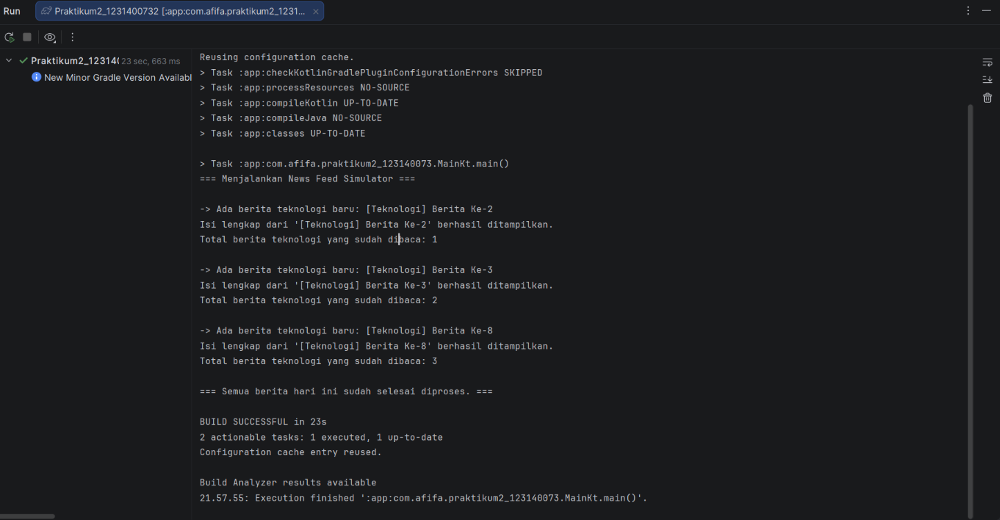

# News Feed Simulator - Praktikum 2

Aplikasi berbasis *console* (Kotlin murni) untuk menyimulasikan sistem aliran berita (*news feed*) menggunakan Kotlin Coroutines dan Flow.

## Fitur Utama
1. **Flow Builder**: Menghasilkan data berita baru secara otomatis.
2. **Flow Operators**: Menggunakan `filter` (menyaring berita kategori Teknologi), `map` (mengubah format teks data), dan `onEach` (mencetak log aktivitas).
3. **StateFlow**: Mengelola status dan menyimpan total jumlah berita yang telah dibaca secara *real-time*.
4. **Coroutines (Async/Await)**: Menyimulasikan proses pengambilan detail berita yang berat secara asinkron di latar belakang menggunakan `Dispatchers.IO`.

## Cara Menjalankan Program
1. Buka *project* ini menggunakan Android Studio.
2. Tunggu proses sinkronisasi Gradle selesai (pastikan menggunakan Gradle JDK versi 17).
3. Buka file `Main.kt` yang berada di dalam direktori `app/src/main/kotlin/...`.
4. Klik tombol **Run** (ikon segitiga hijau) di sebelah kiri blok `fun main()`.

## Dokumentasi Hasil Eksekusi
Berikut adalah output terminal saat simulasi program dijalankan:

