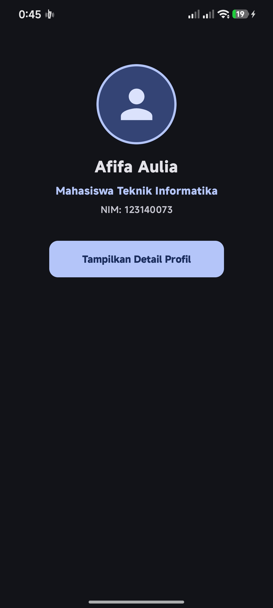
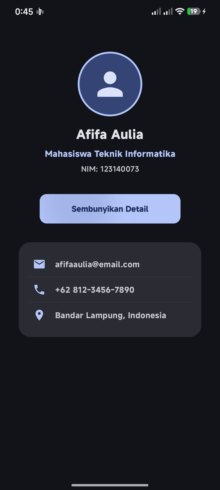

# My Profile App - Praktikum 3

Aplikasi profil sederhana berbasis Android menggunakan Jetpack Compose.

## Kriteria My Profile App
1. **Layout Implementation:** Menggunakan kombinasi `Column`, `Row`, dan `Box` untuk tata letak yang proporsional.
2. **Reusable Composables:** Terdapat 3 custom fungsi yang dapat digunakan ulang, yaitu `ProfileHeader`, `InfoItem`, dan `ProfileCard`.
3. **UI Components:** Menggunakan elemen dasar Compose seperti `Text`, `Button`, `Image/Icon`, dan `Card`.
4. **Modifiers:** Styling ukuran, warna, padding, clip (Circular Avatar), dan bentuk (RoundedCorner) diatur menggunakan Modifier.
5. **Bonus Animasi (+10%):** Menerapkan `AnimatedVisibility` dengan transisi *fade* dan *slide* untuk memunculkan/menyembunyikan detail informasi profil.

## Dokumentasi Hasil Eksekusi

|       Tampilan Awal (Hidden)        |        Tampilan Detail (Shown)        |
|:-----------------------------------:|:-------------------------------------:|
|  |  |